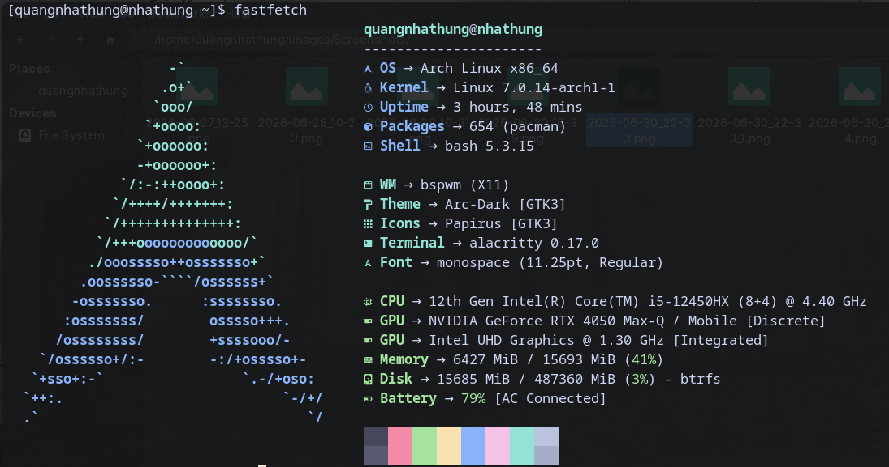

<picture>
  <source media="(prefers-color-scheme: dark)" srcset="https://capsule-render.vercel.app/api?type=waving&color=gradient&customColorList=2&height=220&section=header&text=Quang%20Nhat%20Hung&fontSize=50&fontAlignY=32&desc=Fullstack%20Developer&descAlignY=52&animation=fadeIn">
  <source media="(prefers-color-scheme: light)" srcset="https://capsule-render.vercel.app/api?type=waving&color=gradient&customColorList=14&height=220&section=header&text=Quang%20Nhat%20Hung&fontSize=50&fontAlignY=32&desc=Fullstack%20Developer&descAlignY=52&animation=fadeIn">
  
</picture>

  

  

---

## &nbsp;About Me

Software Engineering student passionate about building practical, real-world software solutions. I combine strong fundamentals in full-stack development with a continuous drive to learn — from distributed systems to cloud-native architecture. Eager to contribute to professional teams and grow as an engineer.

📍 Ho Chi Minh City, Vietnam &nbsp;·&nbsp; ✉️ quangnhathung2005@gmail.com

---

## &nbsp;Tech Stack

  
<b>Frontend</b>

   
  

  
<b>Backend</b>

   
  

  
<b>Database &amp; Cache</b>

   
  

  
<b>DevOps &amp; Tools</b>

   
  

  
<b>Architecture &amp; Patterns</b>

   
  
  &nbsp;
  
  &nbsp;
  
  &nbsp;
  

  
<b>Currently Exploring</b>

   
  
  &nbsp;
  
  &nbsp;
  

---

## &nbsp;Current Focus

<table>
  <tr>
    <td width="50%">
      <h4>🔭 <b>Currently Learning</b></h4>
      Distributed Systems · Kubernetes · DevOps · Microservices
        
      <h4>⚙️ <b>Currently Building</b></h4>
      <i>Real-world full-stack applications with Netcore + React</i>
    </td>
    <td width="50%">
      <h4>💡 <b>Interested In</b></h4>
      Cloud-Native Architecture · System Design · Open Source
        
      <h4>🎯 <b>Career Goal</b></h4>
      Contributing to impactful software as a professional Fullstack Developer
    </td>
  </tr>
</table>

---

## &nbsp;Developer Workspace

<table>
  <tr>
    <td width="50%">
      <h4>⚡ <b>Environment</b></h4>
      
      
      
      
      
      
      
    </td>
    <td width="50%">
      <h4>⌨️ <b>Editor</b></h4>
      
       
      
      
      
      
      
      
      
      
    </td>
  </tr>
</table>

<table>
  <tr>
    <td width="33%">
      <h4>📦 <b>Development Stack</b></h4>
      
    </td>
    <td width="33%">
      <h4>🏗️ <b>Architecture</b></h4>
      
       
      
       
      
       
      
    </td>
    <td width="33%">
      <h4>⭐ <b>Favorite Technologies</b></h4>
      
    </td>
  </tr>
</table>

<h4>📐 <b>Code Philosophy</b></h4>

<h4>🔀 <b>Git Workflow</b></h4>

<h4>🎯 <b>Engineering Philosophy</b></h4>

<blockquote>
  <i>Build maintainable software. Prioritize readability. Write code for humans first, machines second. Optimize for simplicity over cleverness. Performance when it matters. Continuous learning always.</i>
    
  <b>Principles:</b> Clean Architecture · explicit error handling · strong typing · modular design · meaningful naming · consistent patterns · tested behavior
</blockquote>

<h4>🛠️ <b>Productivity Tools</b></h4>

<h4>💻 <b>Terminal</b></h4>

---

## &nbsp;GitHub Analytics

  

  

  

  

---

## &nbsp;Let's Connect

  
  
  

---

## &nbsp;Contribution Snake

<picture>
  <source media="(prefers-color-scheme: dark)" srcset="https://raw.githubusercontent.com/quangnhathung/quangnhathung/output/github-contribution-grid-snake-dark.svg">
  <source media="(prefers-color-scheme: light)" srcset="https://raw.githubusercontent.com/quangnhathung/quangnhathung/output/github-contribution-grid-snake.svg">
  
</picture>

<picture>
  <source media="(prefers-color-scheme: dark)" srcset="https://capsule-render.vercel.app/api?type=waving&color=gradient&customColorList=2&height=120&section=footer&animation=fadeIn">
  <source media="(prefers-color-scheme: light)" srcset="https://capsule-render.vercel.app/api?type=waving&color=gradient&customColorList=14&height=120&section=footer&animation=fadeIn">
  
</picture>
